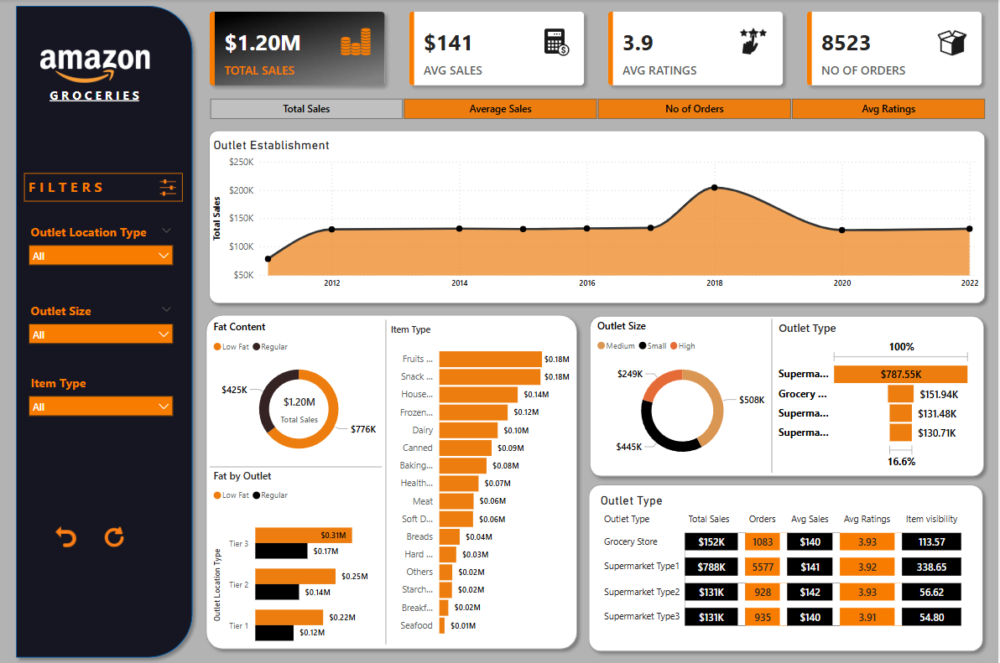

# Powerbi
# 🛒 Amazon Grocery Sales Dashboard

This interactive Power BI dashboard provides a comprehensive analysis of Amazon's grocery sales performance across various outlet types, item categories, and years.

## 📊 Overview

The **Amazon Grocery Sales Dashboard** is designed to help stakeholders gain insights into:

- **Total Sales** over the years  
- **Average Sales per order**
- **Average Ratings** of items
- **Number of Orders** by outlet and item type
- Distribution by:
  - Outlet Type & Size
  - Fat Content
  - Item Category
  - Outlet Location Type (Tier 1, 2, 3)

---

## 📈 Key Metrics

| Metric             | Value        |
|--------------------|--------------|
| 💰 Total Sales     | $1.20M       |
| 🧾 Average Sales   | $141         |
| 🌟 Average Rating  | 3.9          |
| 📦 Total Orders    | 8,523        |

---

## 🧮 Features

- **Interactive Filters**:
  - Outlet Location Type (Tier 1, 2, 3)
  - Outlet Size (Small, Medium, High)
  - Item Type (Fruits, Dairy, Frozen, etc.)

- **Visuals & Charts**:
  - Line graph of yearly sales trends
  - Bar charts for sales breakdown by item type and outlet
  - Donut charts for outlet size and fat content distribution

- **Outlet Analysis**:
  - Performance comparison across Grocery Stores and different Supermarket types
  - Metrics include Total Sales, Orders, Ratings, and Visibility

---

## 📂 File Structure

---

## 🛠️ Tools Used

- **Power BI Desktop** - Data visualization and dashboard creation
- **Excel/CSV** - (Assumed) data source format
- **DAX** - For calculated columns and measures

---

## 🚀 How to Use

1. Open the `.pbix` file using Power BI Desktop.
2. Use the filters on the left panel to drill down into specific data.
3. Hover over the visuals to see tooltips with detailed metrics.
4. Export or share reports as needed.

---

## 📸 Dashboard Preview

---

## 📬 Contact

For any questions or feedback, feel free to reach out!
